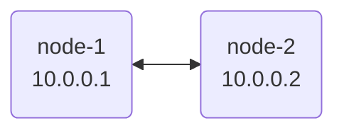

import { Steps } from '@astrojs/starlight/components';

This guide will walk you through setting up a basic nylon network with two nodes.



## Prerequisites

- Two machines with UDP port `57175` open (can configure with a different port).
- The `nylon` binary downloaded on both machines from the [releases page](https://github.com/encodeous/nylon/releases).

:::note
The Linux and macOS versions are well tested, but the Windows client currently has issues. For Windows, we recommend using [WireGuard for Windows](https://www.wireguard.com/install/) and connecting to a Linux/macOS machine as a [passive client](/guides/wg-clients).
:::

<Steps>

1. ### Generate Keypairs

   On each node, generate a WireGuard keypair:

   ```bash
   nylon key
   ```

   This will output two keys (example):

   ```
   kPoLiC4+Nh9AoQGiBmJTh+8BUqCMsa6Zdr4M0Xz5bX0=
   9Z1HGi7eip6GdQezqy3Vc7Er76ZgTfryda9wvHUgWzk=
   ```

   The first key (stdout) is your private key, and the second key (stderr) is your public key. Keep the private key safe, and note down the public key for the next step.

   :::tip
   If you already have a WireGuard keypair, you can use that interchangeably with nylon.
   :::

2. ### Create Node Configuration

   On each node, create a `node.yaml` file. Replace `<YOUR_PRIVATE_KEY>` with the private key generated in step 1.

   ```yaml title="node.yaml"
   id: node-1 # Give each node a unique ID (e.g., node-1, node-2)
   key: <YOUR_PRIVATE_KEY>
   port: 57175
   ```

3. ### Create Central Configuration

   The `central.yaml` file defines the topology of your network. Create one file and share it across all nodes.

   ```yaml title="central.yaml"
   routers:
     - id: node-1
       pubkey: <NODE_1_PUBLIC_KEY>
       endpoints:
         - "node1.example.com:57175" # could be a domain name
         - "192.168.1.2:57175" # could be a local ip
       addresses:
         - 10.0.0.1 # this is the internal nylon IP
     - id: node-2
       pubkey: <NODE_2_PUBLIC_KEY>
       endpoints:
         - "node2.example.com:57175"
       addresses:
         - 10.0.0.2

   # Define the connections between nodes
   graph:
     - node-1, node-2 # This means node-1 and node-2 will try to connect to each other
   ```


4. ### Launch nylon

   Run nylon on both machines:

   ```bash
   sudo nylon run -c central.yaml -n node.yaml
   ```

   After a few seconds, the nodes will discover each other and establish a secure tunnel. You should be able to ping `10.0.0.2` from `node-1`.

</Steps>

## Next Steps

- Learn how to connect [Passive Nodes](/guides/wg-clients) to support edge platforms like iOS.
- Discover how to use [Config Distribution](/guides/config-distribution) to manage your network configuration with ease.
- Setup nylon without a static public IP using [Dynamic DNS & Port Forwarding](/guides/port-forward).
- Explore [Advanced Routing](/guides/advanced-routing). features like Anycast and Prefix Healthchecks.
- View your network's real-time status, and debug issues with [Monitoring and Debugging](/guides/monitoring-debugging).
