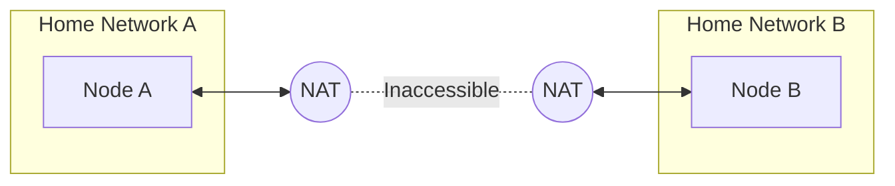

import { Steps, Tabs, TabItem } from '@astrojs/starlight/components';

While nylon can often route traffic through intermediate nodes to overcome NAT issues, **port forwarding** is necessary when your nodes cannot establish any direct, or indirect path due to restrictive NATs.



## Do I Need to Port Forward?

Connectivity in nylon depends on whether at least one node in a peering pair is publicly reachable.

| Your Setup | Port Forwarding? | Reason |
| :--- | :--- | :--- |
| **Node ↔ Public Server** | Not Required | The node behind NAT can connect directly to the public server. |
| **Nodes across multiple NATs** | **Required** | If both nodes are behind NATs (e.g., two different home networks) and there are no other publicly accessible ports, the graph will be disconnected. |

By forwarding a port on at least one node, you ensure that nodes across different networks can always find a path to each other, preventing "isolated islands" in your mesh.

:::tip[Similar to BitTorrent]
If you've ever used BitTorrent, this is the same as being **"connectable."** Just as two "unconnectable" torrent peers cannot share files with each other, two nylon nodes across different NATs cannot establish a tunnel unless at least one of them has an open port.
:::

## Configuration Steps

<Steps>

1. #### Configure Your Router/Firewall

   Log into your router or firewall and create a port forwarding rule:
   - **External Port**: `57175`
   - **Internal Port**: `57175`
   - **Protocol**: `UDP`
   - **Internal IP**: The local IP address of the machine running nylon.

2. #### Handle Dynamic IPs (DDNS)

   If your home or office has a dynamic public IP address, you should use a **Dynamic DNS (DDNS)** service. This ensures that even when your IP changes, other nodes can still find you.

   Popular tools like [ddclient](https://github.com/ddclient/ddclient) can automatically update your DNS records (e.g., Cloudflare, Namecheap, DuckDNS) whenever your public IP changes. Your router may also have built-in DDNS support.

3. #### Update Central Configuration

   Once the port is forwarded and your DNS is set up, tell the rest of the network how to reach this node by adding an `endpoint` to your `central.yaml`.

   ```yaml title="central.yaml"
   routers:
     - id: home-server
       pubkey: <HOME_SERVER_PUBLIC_KEY>
       endpoints:
         - "home.example.com" # Your DDNS hostname
       addresses:
         - 10.0.0.1
   ```

   :::tip
   Nylon periodically re-resolves DNS endpoints. If DDNS updates your record, nylon nodes will quickly pick up the new IP and reconnect automatically.
   :::

4. #### Apply Configuration

   Ensure your changes are pushed to your configuration repository or updated on your nodes. Nylon will automatically detect the new endpoints and attempt to establish connectivity.

</Steps>

## Frequently Asked Questions

### Do I need to forward ports on every node?
**No.** Nylon only needs *at least one* node with a public endpoint (either via port forwarding or a public static IP) to act as a point of entry for the mesh. However, the more nodes that have open ports, the more connected and resilient your network becomes.

### What if I use a different port?
If you use a custom port, you should configure it in your `node.yaml` (for local port), specify it in the `endpoints` section of your node in `central.yaml` (for forwarded port), and update your router's port forwarding rule accordingly.

<Tabs>
  <TabItem label="node.yaml">
    ```yaml
    id: my-node
    port: 12345 # This should match the internal port you forwarded
    ```
  </TabItem>
  <TabItem label="central.yaml">
    ```yaml
    routers:
      - id: my-node
        ...
        endpoints:
          - "home.example.com:12345" # This should match the external port you forwarded
    ```
  </TabItem>
</Tabs>
