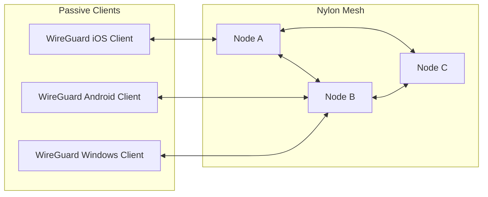

import { Steps } from '@astrojs/starlight/components';

One of nylon's key features is compatibility with standard WireGuard clients (iOS, Android, Windows, etc.). These are called **Passive Nodes/Clients**.

## How it Works

Passive nodes do not participate in the routing protocol. Instead, they connect to a **Gateway Node** (a regular nylon node) which advertises their presence to the rest of the network.



<Steps>

1. ### Configure the Passive Node

   Use any WireGuard app to generate a keypair. Note the public key.

2. ### Update Central Configuration

   Add the passive node to your `central.yaml`. Passive nodes should **not** have endpoints.

   ```yaml title="central.yaml"
   clients:
     - id: node-1 # this node should already exist on the network
       pubkey: <GATEWAY_NODE_PUBLIC_KEY>
       ...
     - id: my-phone
       pubkey: <PHONE_PUBLIC_KEY>
       addresses:
         - 10.0.0.5
   graph:
     - node-1, my-phone # Connect the passive node to a gateway node (e.g., node-1)
   ```

3. ### Connect to a Gateway

   In your WireGuard app, set the `Endpoint` to the address of any nylon node in your network that has a public endpoint.

   ```ini title="wireguard.conf"
   [Interface]
   PrivateKey = <PHONE_PRIVATE_KEY>
   Address = 10.0.0.5/32

   [Peer]
   PublicKey = <GATEWAY_NODE_PUBLIC_KEY>
   Endpoint = gateway.example.com:57175
   AllowedIPs = 10.0.0.0/24 # or whatever you want to route through nylon
   ```

</Steps>

## Limitations

- Passive nodes can only connect to one node at any given time.
- They cannot forward traffic for other nodes.
- They rely on the gateway node for connectivity to the rest of the network.

## Dynamic Routing

Even though passive nodes do not participate in routing, they can still benefit from nylon's dynamic routing capabilities. By configuring multiple VPN profiles using the same private key, a client can switch between gateways automatically.

:::tip
Depending on the WireGuard app, there may be features like Scene-based routing in [Shadowrocket](https://en.wikipedia.org/wiki/Shadowrocket) that can automatically switch the gateway node/VPN profile based on network conditions.

This can help your passive node maintain optimal connectivity, even when you travel.
:::

### No Keepalive Needed

:::note

You do not need to enable Persistent Keepalive, or any heartbeat mechanism for this simple use case.

:::

Nylon retains the route for passive nodes indefinitely, ensuring they remain reachable even if they go idle for an extended period. You should only enable Keepalive if:
1. You need other nodes to be able to initiate connections to the client after long periods of silence.
2. You really wish to drain the battery of the client device for some reason...

For mobile devices, leaving Keepalive disabled is recommended to maximize battery life.


> For a deep dive into how nylon handles roaming and keeps idle clients reachable, see the [Passive Nodes Reference](/reference/passive-nodes).
