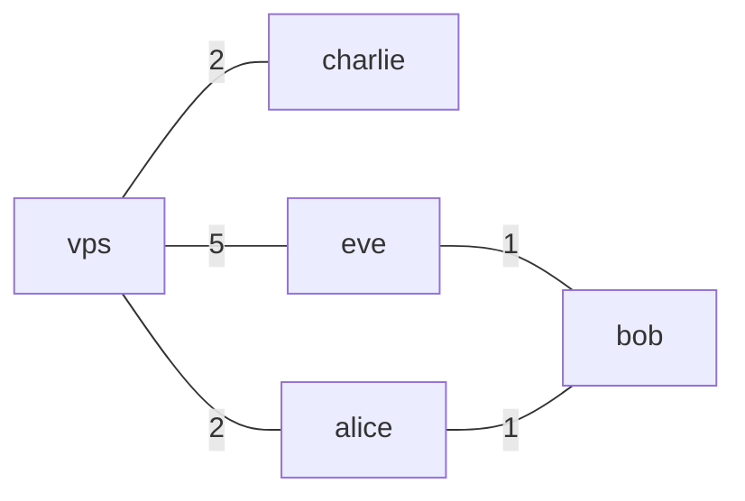
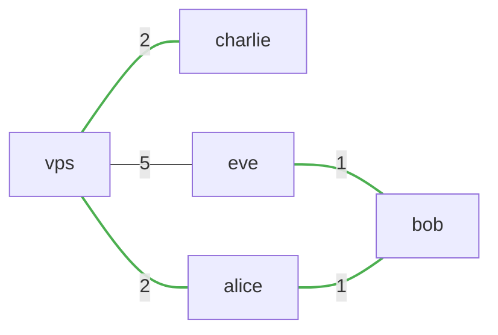
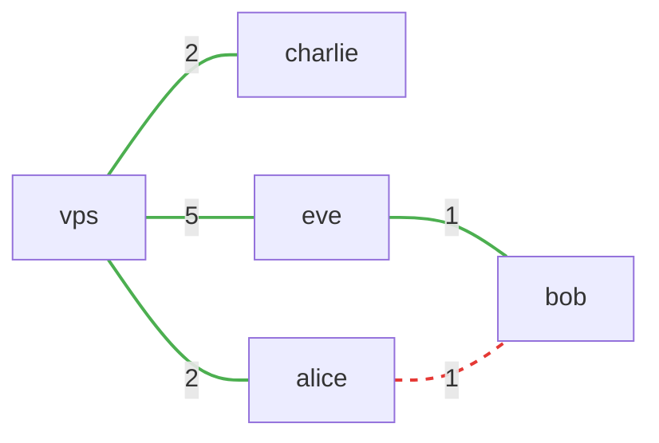

import { Card, CardGrid } from '@astrojs/starlight/components';

Nylon is a **Resilient Overlay Network (RON)** built on **WireGuard** and the **Babel** routing protocol. It provides an intelligent, self-healing mesh that ensures your servers and devices stay connected, even when *some* paths are blocked or unstable.

## Why Nylon?

<CardGrid stagger>
	<Card title="Dynamic Routing" icon="random">
		Built on the Babel routing protocol, nylon handles complex topologies, recovers from outages, and strategically routes traffic for optimal latency.
	</Card>
	<Card title="WireGuard Core" icon="seti:lock">
		Built on top of [wireguard-go](https://github.com/WireGuard/wireguard-go) for high-performance, state-of-the-art encryption.
	</Card>
	<Card title="Ease of Use" icon="rocket">
		Single binary, minimal configuration, and a single UDP port. Deployment has never been simpler.
	</Card>
	<Card title="Backwards Compatible" icon="setting">
		Connect existing WireGuard clients without any extra software.
	</Card>
</CardGrid>

:::note[Is nylon for you?]

Nylon tries [to do one thing, and do it well](https://en.wikipedia.org/wiki/Unix_philosophy): mesh networking. You might be interested in nylon if:

- You have many computers across different locations and want them to stay connected with minimal maintenance.
- You don't mind writing a bit of YAML to configure your network.
- You want a fully FOSS stack you can run on your own infrastructure.

*If you are looking for a zero-config, managed experience, and plenty of addon features for non-technical users, Tailscale is likely a better fit. [See how nylon compares to Tailscale, Nebula, and DIY setups →](/why-nylon)*

:::

## Example

This is a conceptual illustration of how nylon routes traffic. Here is a network of 5 nodes, where the numbers on the edges represent the routing metric (nylon uses latency).

:::note
Nylon does not require a fully connected network. Nodes forward packets on behalf of their neighbours, so routing works as long as any path exists between two nodes. Forwarding can be disabled per-node in config.
:::

From `alice`, nylon selects the path of least metric to each destination (highlighted):

If the `alice - bob` link goes down, the network automatically reconfigures around the failure:

